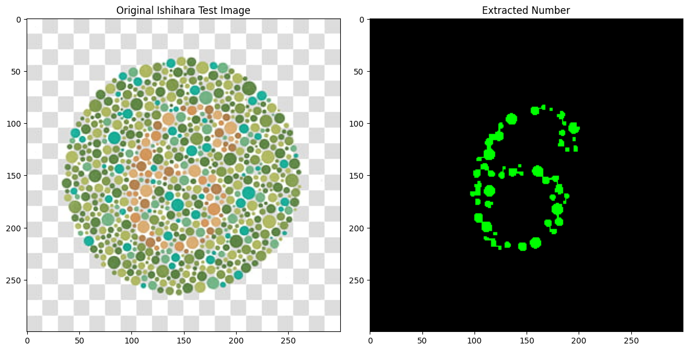

# K-means-cluster-algorithm-from-scratch
Implement the K-means cluster algorithm from scratch and then extract the number inside the color blindness Ishihara test images.
Using diffrenet K values
.png)
.png)

.png)

